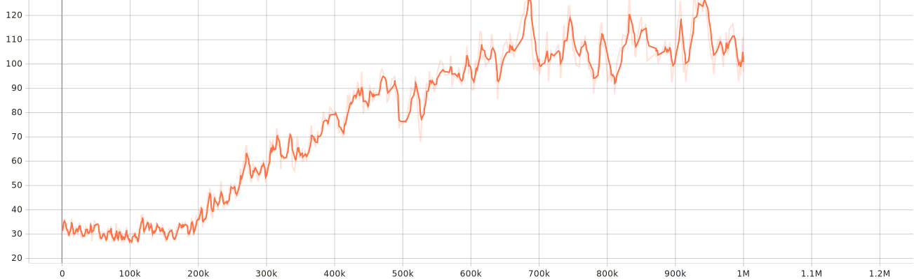

# DQN Agent for 2D Ball Evasion Game

**A Reinforcement Learning agent trained to navigate a 2D continuous space, avoid moving obstacles (balls), and reach a target location.**


*(This GIF is generated from the gameplay video recorded using `record_game.py`)*

## Table of Contents

*   [Overview](#overview)
*   [Environment Details](#environment-details)
    *   [Objective](#objective)
    *   [State Space](#state-space)
    *   [Action Space](#action-space)
    *   [Reward Function](#reward-function)
*   [Agent & Training](#agent--training)
    *   [Algorithm: DQN](#algorithm-dqn)
    *   [Training Process & Monitoring](#training-process--monitoring)
    *   [Learning Rate Schedule](#learning-rate-schedule)
    *   [Hyperparameters](#hyperparameters)
    *   [Training Execution](#training-execution) 
*   [Installation](#installation)
*   [Usage](#usage)
    *   [Training](#training)
    *   [Testing & Evaluation](#testing--evaluation)
    *   [Recording Gameplay](#recording-gameplay)
*   [Evaluation & Analysis](#evaluation--analysis)
    *   [Quantitative Evaluation](#quantitative-evaluation)
    *   [Qualitative Evaluation & Visualization](#qualitative-evaluation--visualization)
*   [Challenges & Solutions](#challenges--solutions)
    *   [Challenge 1: Sparse Rewards & Learning Difficulty](#challenge-1-sparse-rewards--learning-difficulty)
    *   [Challenge 2: Evasion Difficulty & Learning Stability](#challenge-2-evasion-difficulty--learning-stability)
*   [Future Work](#future-work)
*   [Dependencies](#dependencies)

## Overview

This project implements a custom OpenAI Gym environment simulating a 2D game where an agent must learn to navigate towards a target while avoiding linearly moving balls. The balls bounce off the screen edges. A Deep Q-Network (DQN) agent was developed and trained using the Stable Baselines3 library to master this task.

## Environment Details

The custom environment (`GridWorldEnv` in `env.py`) adheres to the OpenAI Gym (Gymnasium) interface.

### Objective

The agent's goal is to reach the designated target position as quickly as possible while avoiding collisions with the linearly moving balls that bounce off the screen edges. The agent receives a score point each time it reaches the target, and the target relocates.

### State Space

The observation provided to the agent is a flattened vector containing key information about the environment's **current timestep only**.

*   **Type:** `gymnasium.spaces.Box` (Continuous)
*   **Shape:** `(2 + k * 4,)`
    *   `k`: This is the `k_closest_obstacles` parameter specified during environment initialization (defaults to 7). It determines how many of the nearest obstacles are included in the state.
    *   Example: If `k=7` (the default), the state vector size is `2 + 7 * 4 = 30`.
*   **Bounds:** The observation space is defined with `low=-2.0` and `high=2.0` (`spaces.Box(low=-2.0, high=2.0, ...)`). Although values are generally normalized (positions divided by `self.size`, velocities by `self._max_obstacle_vel_norm`) to fall mostly within [-1, 1], these bounds provide some margin.
*   **Structure (`2 + k * 4` components):**
    1.  **Relative Goal Position (2 values):** The normalized vector from the agent to the target `(target_x - agent_x, target_y - agent_y) / self.size`. This indicates the direction and scaled distance to the goal.
    2.  **`k` Closest Obstacles Information (`k * 4` values):** For each of the `k` obstacles nearest to the agent (sorted by distance):
        *   **Relative Obstacle Position (2 values):** The normalized vector from the agent to the obstacle `(obstacle_x - agent_x, obstacle_y - agent_y) / self.size`.
        *   **Obstacle Velocity (2 values):** The normalized velocity of the obstacle `(vx, vy) / self._max_obstacle_vel_norm`.
*   **Padding:** If there are fewer than `k` obstacles in the environment, or fewer than `k` are found within a reasonable range, the remaining obstacle slots in the state vector are filled with predefined padding values. Typically, this padding represents a distant ([1.0, 1.0] normalized relative position) and stationary ([0.0, 0.0] normalized velocity) obstacle. This ensures the state vector always has a consistent size (`2 + k * 4`).
*   **No Frame Stacking:** Unlike potential previous versions, this state representation **only includes information from the current timestep**. It does not concatenate states from previous steps. This simplifies the state but requires the agent to infer dynamics (like obstacle movement direction) implicitly through its learned policy or value function over time.


### Action Space

The agent can choose one of five discrete actions at each timestep.

*   **Type:** `gymnasium.spaces.Discrete(5)`
*   **Action Mapping:**
    *   `0`: Move Left
    *   `1`: Move Right
    *   `2`: Move Up
    *   `3`: Move Down
    *   `4`: Do Nothing (Stay Still)

### Reward Function

The reward function is designed to guide the agent towards the goal efficiently while strongly penalizing collisions. The reward is calculated at each step based on the following logic:

*   **Base Penalty (Per Step):** A small negative reward of `-0.01` is applied by default at every timestep. This encourages the agent to reach the goal or terminate via collision relatively quickly, discouraging inefficient wandering.
*   **Collision Penalty:** If the agent collides with an obstacle (`collision == True`), it receives a large negative reward of `-20.0`. This strongly penalizes unsafe actions, and the episode terminates immediately (`terminated = True`).
*   **Goal Reached Reward:** If the agent successfully reaches the target (`goal_reached == True`), it receives a large positive reward of `+50.0`. Upon reaching the target:
    *   The agent's score increases by 1 (`self.score += 1`).
    *   The target is immediately relocated to a new random position (`_place_target()`).
    *   The episode does *not* terminate, allowing the agent to pursue multiple targets within the maximum step limit of a single episode.
*   **Movement Reward Shaping (If No Collision or Goal Reach):** If the agent neither collides nor reaches the goal in the current step, a reward shaping component is calculated based on the change in distance to the goal:
    *   The change in distance is calculated: `distance_change = first_distance - dist_to_goal` (where `first_distance` is the distance at the start of the step and `dist_to_goal` is the distance at the end).
    *   This change is scaled and *added* to the base step penalty: `reward += distance_change * 0.5`.
    *   **Outcome:**
        *   If the agent **moved closer** to the target (`distance_change > 0`), a positive value is added to the `-0.01` base reward, rewarding progress towards the goal.
        *   If the agent **moved farther** from the target (`distance_change < 0`), a negative value is added to the `-0.01` base reward, increasing the penalty for that step.
        *   If the distance **did not change**, the reward for the step remains the base penalty of `-0.01`.

This combination of large terminal rewards/penalties and dense, distance-based reward shaping helps the agent learn the complex task of navigating towards a changing target while actively avoiding obstacles and moving efficiently.
## Agent & Training

### Algorithm: DQN

Deep Q-Network (DQN) was selected as the learning algorithm for this task, suitable for environments with discrete action spaces like ours. The implementation leverages the Stable Baselines3 (SB3) library, providing a robust and well-tested DQN framework based on PyTorch.

### Training Process & Monitoring

The training process was carefully configured and monitored using a combination of custom and standard SB3 callbacks with tensorboard:

*   **Environment Setup:** A single instance of the custom environment (`GridWorldEnv`) wrapped with `Monitor` was used for training, as DQN is an off-policy algorithm. A separate, identical environment instance was created for evaluation.
*   **Custom Evaluation (`CustomEvalCallback`):**
    *   Evaluated the agent's performance every 50 training episodes (`eval_freq=50`) on the separate `eval_env`.
    *   Ran 10 deterministic evaluation episodes (`n_eval_episodes=10`) per evaluation cycle.
    *   Tracked the mean, max, and min scores achieved during these evaluation episodes.
    *   Saved the model checkpoint whenever a new `best_mean_score` was achieved during evaluation to `[log_dir]/best_model.zip`.
    *   Logged evaluation metrics (`eval/mean_score`, `eval/max_episode_score`, etc.) to TensorBoard.
*   **Checkpointing (`CheckpointCallback`):** Saved the current state of the model every 80,000 training timesteps (`save_freq=80000`) to the specified save directory (`save_path`), prefixed with `dqn_model`.
*   **Learning Rate Logging (`LrLoggingCallback`):** Logged the current learning rate to TensorBoard (`train/learning_rate`) every 100 steps (`log_freq=100`) to monitor the decay schedule. Also logged `train/timesteps` and `train/progress`.
*   **Rollout Metrics Logging (`RolloutMetricsCallback`):** Collected reward and score information during each training rollout (the steps between policy updates). At the end of each rollout, calculated and logged the mean/max reward and score (`rollout/mean_reward`, `rollout/mean_score`, etc.) along with standard deviations to TensorBoard. This provides insight into the agent's performance during the exploration/training phase itself.
*   **TensorBoard Logging:** Extensive logging was configured using `tensorboard_log=log_dir`. Training progress, evaluation results, rollout metrics, and learning rate were visualized using TensorBoard under the run name specified (`tb_log_name="DQN"`).

### Learning Rate Schedule

A **linear learning rate decay** schedule (`linear_lr_schedule`) was employed. The learning rate started at an initial value (`initial_lr = 0.001`) and decreased linearly throughout the training process based on the fraction of remaining timesteps, down to a minimum value close to zero.

### Hyperparameters

The DQN agent was trained using the `MlpPolicy` (Multi-Layer Perceptron) and the following key hyperparameters, derived from the `train_dqn` function in `train.py`:

*   `policy`: "MlpPolicy"
*   `learning_rate`: Linear schedule starting at `0.001`
*   `buffer_size`: 100,000 (Replay buffer capacity)
*   `learning_starts`: 1,000 (Timesteps before learning starts)
*   `batch_size`: 64
*   `gamma`: 0.99 (Discount factor)
*   `tau`: 0.005 (Soft update coefficient for target network)
*   `target_update_interval`: 1,000 (Frequency of target network updates)
*   `exploration_fraction`: 0.2 (Fraction of training steps for epsilon decay)
*   `exploration_initial_eps`: 1.0 (Initial exploration rate)
*   `exploration_final_eps`: 0.05 (Final exploration rate)
*   `max_grad_norm`: 10 (Gradient clipping value)

*(Note: Although PPO and A2C training functions exist in `train.py`, only the DQN agent was trained for this project based on the provided information.)*

### Training Execution

The agent was trained for a total of 1_000,000 timesteps using the following command:

```bash
python train.py --algorithm dqn --obstacles 13 --timesteps 1000000
```

## Installation

1.  Clone the repository:
    ```bash
    git clone https://github.com/huseyinbayoglu/Continuos-dodgegame-2
    ```
    
    
2.  Install dependencies (preferably in a virtual environment):
    ```bash
    pip install -r requirements.txt
    ```


## Usage

### Training

To train a new agent:

```
python train.py --timesteps 500000 
```

### Testing & Evaluation

The trained DQN agent's performance was evaluated quantitatively and qualitatively using the `test.py` script.
```bash
python test.py --model-path ./models/final_model_dqn.zip --episodes 50 --obstacles 13 
```

### Recording Gameplay
To record the agent's gameplay as an MP4 video:
```bash
python record_game.py --model_path ./models/final_model_dqn.zip --output gameplay.mp4 --episodes 5 --obstacles 13
```


## Evaluation & Analysis
The trained DQN agent's performance was evaluated quantitatively and qualitatively using the test.py and record_game.py scripts.
*   **Execution:** The script loads the saved DQN model (`.zip` file).
*   **Metrics Reported:**
    *   **Average Reward per Episode:** The mean total reward accumulated across the evaluation episodes.
    *   **Average Steps per Episode:** The mean number of steps taken per episode.
    *   **Average Score per Episode :** The mean score of episodes.
*   **Example Command:**
    ```bash
    python test.py --model-path ./models/final_model_dqn.zip --model-type dqn --episodes 50 --obstacles 13 
    ```

### Quantitative Evaluation

The trained DQN agent's performance was rigorously evaluated using the `test.py` script. The evaluation ran the agent with a **deterministic policy** (no exploration noise) for **50 episodes** in the environment configured with **13 obstacles**.

The key performance metrics achieved at the end of training are summarized below:

*   **Average Score per Episode:** 3.38 ± 2.69  *(The agent successfully reached the target an average of 3.38 times per episode, with a standard deviation of 2.69)*
*   **Average Reward per Episode:** 152.7 ± 137.3 *(This reflects the cumulative reward considering both goal achievements and penalties.)*
*   **Average Steps per Episode:** 129.3 ± 87.1*(Indicates how quickly, on average, the agent completed episodes, either by reaching a step limit or colliding.)*


These results demonstrate the agent's capability to consistently achieve the objective. The learning progress over the 1 million training timesteps is visualized below:

**Learning Progress: Mean Evaluation Score**


*The graph above shows the average score achieved during periodic evaluations (10 episodes, deterministic policy) approximately every 50 training episodes throughout the 1 million training timesteps. The clear upward trend demonstrates the agent's successful learning progress in mastering the task of reaching the target while avoiding obstacles.*

**Peak Performance: Best Mean Evaluation Score**


*This graph tracks the best average evaluation score achieved up to each point in training, derived from the `eval/mean_score` data. It highlights the peak performance level reached and maintained by the agent as training progressed.*


**Learning Progress: Mean Episode Length During Training**



*This plot displays the average episode length (number of steps) during the training rollouts (exploration phase). The increasing trend indicates that the agent learned to survive longer within the environment over time, suggesting improved obstacle avoidance and navigation skills were developed during exploration.*

**Learning Progress: Mean Reward During Training**


*The average reward collected per episode during training rollouts is shown above. The general upward trend, despite fluctuations due to exploration, reflects the agent's increasing ability to find rewarding trajectories (reaching goals more often, incurring fewer collision penalties) during the training process.*

### Qualitative Evaluation & Visualization

Beyond numerical metrics, `test.py` provides tools to visually understand the agent's behavior and decision-making process:

1.  **Live Rendering & GIF Recording:**
    *   You can watch the agent play in real-time by running the script without the `--no-render` flag.
    *   Using the `--record` flag generates an animated GIF (`navigation_agent.gif`) of a single test episode, clearly showing the agent's movement, obstacle avoidance (or lack thereof), and pathfinding.
    *   **Example Command (Record GIF):**
        ```bash
        python test.py --model-path ./models/best_model.zip --model-type dqn --episodes 10 --obstacles 13 --record
        ```

2.  **Policy and Value Function Heatmaps (`--visualize-policy`):**
    *   The `generate_heatmap` function creates a detailed visualization (`rl_agent_heatmap.png`) showing the agent's learned strategy across the state space for a *fixed* environment configuration (goal and obstacle positions from a specific seed).
    *   **Method:** It samples points across the 2D grid. For each point (assuming it's the agent's location), it queries the trained DQN model to:
        *   Estimate the **Q-value** of the best action (representing the expected future discounted reward from that state).
        *   Determine the **best action** (policy) the agent would take.
    *   **Output:** Two side-by-side heatmaps:
        *   **Value Heatmap:** Shows regions estimated to be high-value (closer to the goal, safer) versus low-value (dangerous, far from goal). Helps understand where the agent *wants* to go.
        *   **Policy Heatmap:** Shows the specific action (Left, Right, Up, Down, Stay) the agent would choose at each location, visualized with distinct colors. Helps understand *how* the agent plans to move.
        *   Goal, initial agent position (from the seed), and obstacle locations are overlaid for context.
    *   
        
    *   **Example Command (Generate Heatmap):**
        ```bash
        python test.py --model-path ./models/DQN_RunName/best_model.zip --model-type dqn --episodes 1 --obstacles 13 --no-render --visualize-policy
        ```


These visualization tools were crucial in analyzing the agent's learned behaviors, identifying potential shortcomings (like poor obstacle avoidance despite reaching the target), and iterating on the environment design and training process.

## Challenges & Solutions
Several challenges were encountered during the development and training process:

### Challenge 1: Sparse Rewards & Learning Difficulty
* **Problem**: With a high number of evasive balls, the agent rarely reached the target initially. Relying solely on the sparse reward for reaching the target resulted in the agent failing to learn any meaningful policy.
* **Solution**: Implemented **reward shaping** based on the distance to the target. Providing smaller, more frequent rewards for getting closer (and penalties for getting farther) gave the agent a clearer learning signal, enabling it to gradually develop effective navigation strategies.


### Challenge 2: Evasion Difficulty & Learning Stability
* **Problem**: The dynamic nature of the moving balls made evasion difficult, leading to unstable learning or slow convergence with default hyperparameters. The agent would often get stuck in suboptimal policies or fail to generalize.
* **Solution**: Performed **hyperparameter tuning**, particularly focusing on the learning rate. Lowering the learning rate (e.g., from 1e-3 to 1e-4) and extending the training duration allowed the agent to learn more gradually and stably, ultimately achieving better and more consistent performance in dodging the balls.

## Future Work
Potential improvements and future directions for this project include:

* Implementing and comparing other RL algorithms (e.g., PPO, A2C) using Stable Baselines3.
* Increasing the complexity of the environment (e.g., balls with different speeds or non-linear trajectories, multiple targets).
*  Exploring different neural network architectures for the policy/value function (e.g., deeper networks, different activation functions, attention mechanisms).
*  Implementing curriculum learning, starting with fewer obstacles or slower speeds and gradually increasing the difficulty during training.
*  Extended Training on Cloud Platforms: Train the current DQN agent (or other algorithms) for significantly longer durations (e.g., tens of millions of timesteps) using cloud computing resources (like AWS, Google Cloud, or Azure). The increased training time, combined with potentially larger replay buffers, may allow the agent to learn more complex and robust obstacle avoidance behaviors, which appeared challenging to fully master within the current training budget.
*   Fine-tuning the reward function further to better incentivize both reaching the target and avoiding obstacles simultaneously.

## Dependencies 

* gymnasium
* numpy
* pygame
* stable-baselines3
* torch
* tensorboard
* opencv-python


