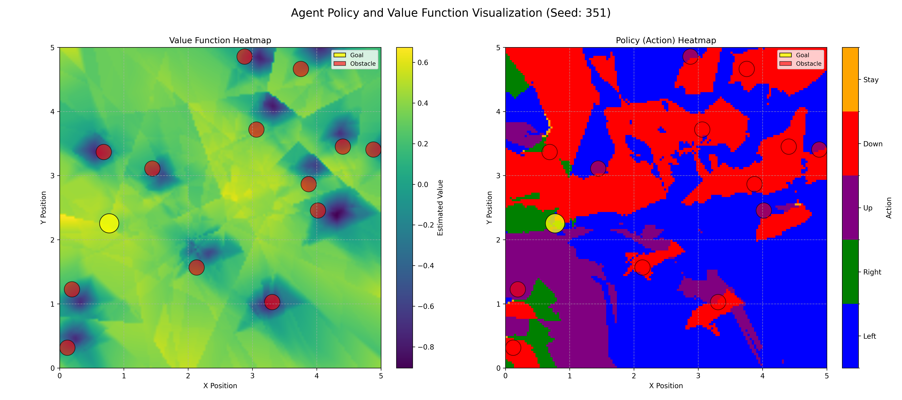

# DQN Agent for 2D Ball Evasion Game

**A Reinforcement Learning agent trained to navigate a 2D continuous space, avoid moving obstacles (balls), and reach a target location.**


*(This GIF is generated from the gameplay video recorded using `record_game.py`)*

## Table of Contents

*   [Overview](#overview)
*   [Environment Details](#environment-details)
    *   [Objective](#objective)
    *   [State Space](#state-space)
    *   [Action Space](#action-space)
    *   [Reward Function](#reward-function)
*   [Agent & Training](#agent--training)
    *   [Algorithm: DQN](#algorithm-dqn)
    *   [Training Process & Monitoring](#training-process--monitoring)
    *   [Learning Rate Schedule](#learning-rate-schedule)
    *   [Hyperparameters](#hyperparameters)
    *   [Training Execution](#training-execution) 
*   [Installation](#installation)
*   [Usage](#usage)
    *   [Training](#training)
    *   [Testing & Evaluation](#testing--evaluation)
    *   [Recording Gameplay](#recording-gameplay)
*   [Evaluation & Analysis](#evaluation--analysis)
    *   [Quantitative Evaluation](#quantitative-evaluation)
    *   [Qualitative Evaluation & Visualization](#qualitative-evaluation--visualization)
*   [Challenges & Solutions](#challenges--solutions)
    *   [Challenge 1: Sparse Rewards & Learning Difficulty](#challenge-1-sparse-rewards--learning-difficulty)
    *   [Challenge 2: Evasion Difficulty & Learning Stability](#challenge-2-evasion-difficulty--learning-stability)
*   [Future Work](#future-work)
*   [Dependencies](#dependencies)

## Overview

This project implements a custom OpenAI Gym environment simulating a 2D game where an agent must learn to navigate towards a target while avoiding linearly moving balls. The balls bounce off the screen edges. A Deep Q-Network (DQN) agent was developed and trained using the Stable Baselines3 library to master this task.

## Environment Details

The custom environment (`GridWorldEnv` in `env.py`) adheres to the OpenAI Gym (Gymnasium) interface.

### Objective

The agent's goal is to reach the designated target position as quickly as possible while avoiding collisions with the linearly moving balls that bounce off the screen edges. The agent receives a score point each time it reaches the target, and the target relocates.

### State Space
The observation provided to the agent is designed to give comprehensive information about the environment's current situation and recent history. It's a flattened vector representing the state from the **last 3 consecutive timesteps**.

*   **Type:** `gymnasium.spaces.Box` (Continuous)
*   **Shape:** `( (4 + 9 + num_obstacles * 7) * 3, )`
    *   `num_obstacles`: The number of obstacles in the environment (initialized as 13 in default).
    *   `single_state_size = 4 + 9 + num_obstacles * 7` represents the information from a single timestep.
    *   The `* 3` indicates the concatenation of the last three single-timestep states.
*   **Bounds:** Values are generally normalized and clipped, mostly falling within the [-1, 1] range due to division by `self.size`, although the Box is defined with `low=-size, high=size`.
*   **Structure of a Single Timestep State (`single_state_size` components):**
    1.  **Character Position (2 values):** Normalized agent's (x, y) coordinates (`_character_position / self.size`).
    2.  **Goal Position (2 values):** Normalized target's (x, y) coordinates (`_goal_position / self.size`).
    3.  **3 Closest Obstacles Information (9 values):** For each of the three obstacles currently closest to the agent:
        *   Normalized X-distance from obstacle to agent (`(obs_x - char_x) / self.size`).
        *   Normalized Y-distance from obstacle to agent (`(obs_y - char_y) / self.size`).
        *   Normalized Linear distance from obstacle to agent (`distance / max_distance`).
        *(Obstacles are sorted by distance, and padded with `(0.0, 0.0, 1.0)` if fewer than 3 exist).*
    4.  **All Obstacles Detailed Information (`num_obstacles * 7` values):** For *each* of the `num_obstacles` obstacles:
        *   Normalized Obstacle Position (2 values): (x, y) coordinates (`_obstacle_positions[i] / self.size`).
        *   Obstacle Velocity (2 values): (vx, vy) components (in environment units, not explicitly normalized in the state vector but magnitude is fixed).
        *   Normalized Relative Distance to Character (3 values):
            *   Normalized X-distance from character to obstacle (`(char_x - obs_x) / self.size`).
            *   Normalized Y-distance from character to obstacle (`(char_y - obs_y) / self.size`).
            *   Normalized Linear distance from character to obstacle (`distance / max_distance`).
*   **State History:** The final observation vector fed to the agent is the concatenation of the single-timestep state vectors from the current timestep and the two preceding timesteps. This provides the agent with information about the recent dynamics of the environment (e.g., obstacle movement directions).

### Action Space

The agent can choose one of five discrete actions at each timestep.

*   **Type:** `gymnasium.spaces.Discrete(5)`
*   **Action Mapping:**
    *   `0`: Move Left
    *   `1`: Move Right
    *   `2`: Move Up
    *   `3`: Move Down
    *   `4`: Do Nothing (Stay Still)

### Reward Function

The reward function is designed to guide the agent towards the goal while penalizing collisions and encouraging efficient movement. The reward is calculated at each step based on the following logic:

*   **Base Penalty (Per Step):** A small negative reward of `-0.4` is given by default in each step. This encourages the agent to complete the episode (either by reaching the target or failing) relatively quickly, discouraging indefinite wandering.
*   **Collision Penalty:** If the agent collides with an obstacle (`collision == True`), it receives a large negative reward of `-40`. This strongly penalizes unsafe actions and terminates the current episode (`terminated = True`).
*   **Goal Reached Reward:** If the agent successfully reaches the target (`goal_reached == True`), it receives a large positive reward of `+20`. Upon reaching the target, the agent's score increases by 1, and the target is immediately relocated to a new random position (`_place_target()`). The episode does *not* terminate immediately upon reaching the goal (allowing for multi-goal episodes within the step limit).
*   **Movement Reward Shaping:** If the agent does *not* collide and does *not* reach the target in the current step:
    *   If the agent **moved closer** to the target compared to its position at the beginning of the step (`dist_to_goal < first_distance`), the reward for that step is overridden to become `+0.3`. This positive reward shaping provides a denser guidance signal, helping the agent learn to approach the target even before achieving the large goal reward, which was crucial for overcoming the initial sparse reward problem.
    *   If the agent **did not move closer** to the target, the reward remains the default base penalty of `-0.4`. There is no explicit *additional* penalty for moving away, but the agent misses out on the positive shaping reward.

This combination of large terminal rewards/penalties and dense movement-based reward shaping helps the agent learn the complex task of navigating towards a changing target while actively avoiding obstacles.

## Agent & Training

### Algorithm: DQN

Deep Q-Network (DQN) was selected as the learning algorithm for this task, suitable for environments with discrete action spaces like ours. The implementation leverages the Stable Baselines3 (SB3) library, providing a robust and well-tested DQN framework based on PyTorch.

### Training Process & Monitoring

The training process was carefully configured and monitored using a combination of custom and standard SB3 callbacks with tensorboard:

*   **Environment Setup:** A single instance of the custom environment (`GridWorldEnv`) wrapped with `Monitor` was used for training, as DQN is an off-policy algorithm. A separate, identical environment instance was created for evaluation.
*   **Custom Evaluation (`CustomEvalCallback`):**
    *   Evaluated the agent's performance every 50 training episodes (`eval_freq=50`) on the separate `eval_env`.
    *   Ran 10 deterministic evaluation episodes (`n_eval_episodes=10`) per evaluation cycle.
    *   Tracked the mean, max, and min scores achieved during these evaluation episodes.
    *   Saved the model checkpoint whenever a new `best_mean_score` was achieved during evaluation to `[log_dir]/best_model.zip`.
    *   Logged evaluation metrics (`eval/mean_score`, `eval/max_episode_score`, etc.) to TensorBoard.
*   **Checkpointing (`CheckpointCallback`):** Saved the current state of the model every 80,000 training timesteps (`save_freq=80000`) to the specified save directory (`save_path`), prefixed with `dqn_model`.
*   **Learning Rate Logging (`LrLoggingCallback`):** Logged the current learning rate to TensorBoard (`train/learning_rate`) every 100 steps (`log_freq=100`) to monitor the decay schedule. Also logged `train/timesteps` and `train/progress`.
*   **Rollout Metrics Logging (`RolloutMetricsCallback`):** Collected reward and score information during each training rollout (the steps between policy updates). At the end of each rollout, calculated and logged the mean/max reward and score (`rollout/mean_reward`, `rollout/mean_score`, etc.) along with standard deviations to TensorBoard. This provides insight into the agent's performance during the exploration/training phase itself.
*   **TensorBoard Logging:** Extensive logging was configured using `tensorboard_log=log_dir`. Training progress, evaluation results, rollout metrics, and learning rate were visualized using TensorBoard under the run name specified (`tb_log_name="DQN"`).

### Learning Rate Schedule

A **linear learning rate decay** schedule (`linear_lr_schedule`) was employed. The learning rate started at an initial value (`initial_lr = 0.001`) and decreased linearly throughout the training process based on the fraction of remaining timesteps, down to a minimum value close to zero.

### Hyperparameters

The DQN agent was trained using the `MlpPolicy` (Multi-Layer Perceptron) and the following key hyperparameters, derived from the `train_dqn` function in `train.py`:

*   `policy`: "MlpPolicy"
*   `learning_rate`: Linear schedule starting at `0.001`
*   `buffer_size`: 100,000 (Replay buffer capacity)
*   `learning_starts`: 1,000 (Timesteps before learning starts)
*   `batch_size`: 64
*   `gamma`: 0.99 (Discount factor)
*   `tau`: 0.005 (Soft update coefficient for target network)
*   `target_update_interval`: 1,000 (Frequency of target network updates)
*   `exploration_fraction`: 0.2 (Fraction of training steps for epsilon decay)
*   `exploration_initial_eps`: 1.0 (Initial exploration rate)
*   `exploration_final_eps`: 0.05 (Final exploration rate)
*   `max_grad_norm`: 10 (Gradient clipping value)

*(Note: Although PPO and A2C training functions exist in `train.py`, only the DQN agent was trained for this project based on the provided information.)*

### Training Execution

The agent was trained for a total of 500,000 timesteps using the following command:

```bash
python train.py --algorithm dqn --obstacles 13 --timesteps 500000 --log-dir ./logs/DQN_RunName --save-dir ./models/DQN_RunName
```

## Installation

1.  Clone the repository:
    ```bash
    git clone https://github.com/huseyinbayoglu/Continuos-dodgegame-2
    ```
    
    
2.  Install dependencies (preferably in a virtual environment):
    ```bash
    pip install -r requirements.txt
    ```


## Usage

### Training

To train a new agent:

```
python train.py --timesteps 500000 
```

### Testing & Evaluation

The trained DQN agent's performance was evaluated quantitatively and qualitatively using the `test.py` script.
```bash
python test.py --model-path ./models/best_model.zip --episodes 50 --obstacles 13 
```

### Recording Gameplay
To record the agent's gameplay as an MP4 video:
```bash
python record_game.py --model_path ./models/best_model.zip --output gameplay.mp4 --episodes 5 --obstacles 13
```


## Evaluation & Analysis
The trained DQN agent's performance was evaluated quantitatively and qualitatively using the test.py and record_game.py scripts.

### Quantitative Evaluation

The `test_model` function in `test.py` runs the trained agent in the environment for a specified number of episodes using a **deterministic policy** (i.e., always choosing the action with the highest predicted Q-value, without exploration).

*   **Execution:** The script loads the saved DQN model (`.zip` file).
*   **Metrics Reported:**
    *   **Success Rate:** The percentage of episodes where the agent successfully reached the final target location (defined in the script as distance to goal < 0.5 at episode end).
    *   **Average Reward per Episode:** The mean total reward accumulated across the evaluation episodes.
    *   **Average Steps per Episode:** The mean number of steps taken per episode.
*   **Example Command:**
    ```bash
    python test.py --model-path ./models/best_model.zip --model-type dqn --episodes 50 --obstacles 13 
    ```


### Qualitative Evaluation & Visualization

Beyond numerical metrics, `test.py` provides tools to visually understand the agent's behavior and decision-making process:

1.  **Live Rendering & GIF Recording:**
    *   You can watch the agent play in real-time by running the script without the `--no-render` flag.
    *   Using the `--record` flag generates an animated GIF (`navigation_agent.gif`) of a single test episode, clearly showing the agent's movement, obstacle avoidance (or lack thereof), and pathfinding.
    *   **Example Command (Record GIF):**
        ```bash
        python test.py --model-path ./models/DQN_RunName/best_model.zip --model-type dqn --episodes 1 --obstacles 13 --record
        ```

2.  **Policy and Value Function Heatmaps (`--visualize-policy`):**
    *   The `generate_heatmap` function creates a detailed visualization (`rl_agent_heatmap.png`) showing the agent's learned strategy across the state space for a *fixed* environment configuration (goal and obstacle positions from a specific seed).
    *   **Method:** It samples points across the 2D grid. For each point (assuming it's the agent's location), it queries the trained DQN model to:
        *   Estimate the **Q-value** of the best action (representing the expected future discounted reward from that state).
        *   Determine the **best action** (policy) the agent would take.
    *   **Output:** Two side-by-side heatmaps:
        *   **Value Heatmap:** Shows regions estimated to be high-value (closer to the goal, safer) versus low-value (dangerous, far from goal). Helps understand where the agent *wants* to go.
        *   **Policy Heatmap:** Shows the specific action (Left, Right, Up, Down, Stay) the agent would choose at each location, visualized with distinct colors. Helps understand *how* the agent plans to move.
        *   Goal, initial agent position (from the seed), and obstacle locations are overlaid for context.
    *   
        
    *   **Example Command (Generate Heatmap):**
        ```bash
        python test.py --model-path ./models/DQN_RunName/best_model.zip --model-type dqn --episodes 1 --obstacles 13 --no-render --visualize-policy
        ```


These visualization tools were crucial in analyzing the agent's learned behaviors, identifying potential shortcomings (like poor obstacle avoidance despite reaching the target), and iterating on the environment design and training process.

## Challenges & Solutions
Several challenges were encountered during the development and training process:

### Challenge 1: Sparse Rewards & Learning Difficulty
* **Problem**: With a high number of evasive balls, the agent rarely reached the target initially. Relying solely on the sparse reward for reaching the target resulted in the agent failing to learn any meaningful policy.
* **Solution**: Implemented **reward shaping** based on the distance to the target. Providing smaller, more frequent rewards for getting closer (and penalties for getting farther) gave the agent a clearer learning signal, enabling it to gradually develop effective navigation strategies.


### Challenge 2: Evasion Difficulty & Learning Stability
* **Problem**: The dynamic nature of the moving balls made evasion difficult, leading to unstable learning or slow convergence with default hyperparameters. The agent would often get stuck in suboptimal policies or fail to generalize.
* **Solution**: Performed **hyperparameter tuning**, particularly focusing on the learning rate. Lowering the learning rate (e.g., from 1e-3 to 1e-4) and extending the training duration allowed the agent to learn more gradually and stably, ultimately achieving better and more consistent performance in dodging the balls.

## Future Work
Potential improvements and future directions for this project include:

* Implementing and comparing other RL algorithms (e.g., PPO, A2C) using Stable Baselines3.
* Increasing the complexity of the environment (e.g., balls with different speeds or non-linear trajectories, multiple targets).
*  Exploring different neural network architectures for the policy/value function (e.g., deeper networks, different activation functions, attention mechanisms).
*  Implementing curriculum learning, starting with fewer obstacles or slower speeds and gradually increasing the difficulty during training.
*  Extended Training on Cloud Platforms: Train the current DQN agent (or other algorithms) for significantly longer durations (e.g., tens of millions of timesteps) using cloud computing resources (like AWS, Google Cloud, or Azure). The increased training time, combined with potentially larger replay buffers, may allow the agent to learn more complex and robust obstacle avoidance behaviors, which appeared challenging to fully master within the current training budget.
*   Fine-tuning the reward function further to better incentivize both reaching the target and avoiding obstacles simultaneously.

## Dependencies 

* gymnasium
* numpy
* pygame
* stable-baselines3
* torch
* tensorboard
* opencv-python
